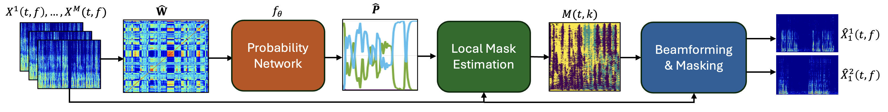

# Deep-Simplex

This repository contains the official code for the paper:

> **Deep-Simplex Multichannel Speech Separation**  
> Tzlil Avidan, Bracha Laufer-Goldshtein  
> Accepted to Interspeech 2025
> [Download Paper (PDF)](./Deep_Simplex.pdf)
---

## 🧠 Overview

This project introduces **Deep-Simplex**, a novel unsupervised approach for **global speaker activity estimation** in multichannel speech separation. It is inspired by geometric principles of probabilistic simplexes and extends previous work such as GLOSS with a deep model that learns the global activity matrix **P**, which approximates spatial correlation matrices.
We extend the original [GLOSS](https://ieeexplore.ieee.org/document/9204443) method by 
learning a deep prior over the simplex using a deep learning network trained unsupervisedly per each sample at test time.
The original method is implemented for comparison.

---
## 📂 Directory Structure

- `separation_pipeline.py` — main script for running full experiments
- `unsupervised.py` — Deep-Simplex model training and inference
- `global_models/` — LSTM_Att (our used deep network), MiSiC Transformer model definitions.
- `data_simulator/` — Libri-style synthetic data creation
- `functions.py` — classic SPA baselines, feature extraction, and evaluation logic
- `beamforming.py` — LCMV beamforming and reconstruction
- `custom_losses.py` — SAD and L2 loss functions, permutation evaluation
- `utils.py` — smoothing, mask error, signal energy utilities
- `CFG.py` — global experiment configuration
---

## 🛠 How to Use This Code

### ✅ Stage 1: Prepare LibriSpeech-style Audio

You must have a LibriSpeech-style dataset, e.g., `dev-clean-test/`, containing 
speaker subfolders with `.flac` files.

Then run data_simulator "__main__" with the wanted scenario mix. 
This will create spaced long audio signals per speaker for training and validation:
- dev-wav-{seconds_delay_max}-{seconds_delay_min}/train/
- dev-wav-{seconds_delay_max}-{seconds_delay_min}/val/

### ✅ Stage 2: Run the Separation Experiments
Once the synthetic data is generated, launch a full separation experiment by running
separation_pipeline "__main__" with the wanted scenarios. 
You can modify:
- `J`: number of speakers (e.g. `2` or `3`)
- `rev`: reverberation time in seconds (e.g. `0.3`, `0.6`)
- `overlap_demand`: desired overlap ratio between speakers (e.g. `1` for full overlap, `0.5` for partial)
- `data_mode`: `'libri'` or `'wsj'`
- 
Notice that you can change CFG.py file to affect different signal parameter and model hyperparameters.

### ✅ What Happens Internally

When you run `run_scenario(...)`, the following steps are executed:

1. **Synthetic Mixture Creation**  
   - Randomly select `J` speakers  
   - Apply RIRs and generate reverberant mixtures  
   - Compute spatial correlation matrix `W`

2. **Global Model Estimation (Deep-Simplex)**  
   - A BiLSTM-based model estimates the global speaker activity matrix `P`  
   - Optimized so that `W ≈ P @ Pᵀ` using a combination of SAD + L2 loss

3. **Local Mask Estimation**  
   - Time-frequency bins are assigned to speakers by matching `P` to local features  
   - Implemented using nearest-neighbor search

4. **Beamforming (LCMV)**  
   - Apply LCMV beamforming using the estimated masks to reconstruct time-domain signals  
   - Metrics such as SDR, SI-SDR, STOI, PESQ are calculated

---

For questions or collaborations, contact: **tzlilavidan@mail.tau.ac.il**

## 📎 References

### Core Methods

- **GLOSS (Simplex)**  
  Dovrat, Y., Shon, S., Jansson, A., & Glass, J.  
  _Global Latent Optimization for Source Separation_  
  IEEE Transactions on Audio, Speech, and Language Processing, 2020  
  [arXiv:2001.10772](https://arxiv.org/abs/2001.10772)  
  [Code](https://github.com/yluo42/TAC)

- **MiSiCNet**  
  Jin, Y., Deng, B., Xie, Y., & Zhu, F.  
  _Minimum Simplex Convolutional Network for Hyperspectral Unmixing_  
  [arXiv:2303.06171](https://arxiv.org/abs/2303.06171)  
  [Code](https://github.com/Yongliangjie/MiSiCNet)

- **Transformer Unmixing**  
  Fang, M., Xu, K., & Wang, Y.  
  _Hyperspectral Unmixing Using Transformer Network_  
  [arXiv:2305.14678](https://arxiv.org/abs/2305.14678)

- **BiLSTM Architecture**  
- **NBSS (Quan & Li)**  
  Quan, C., & Li, X.  
  _Multi-Channel Narrow-Band Deep Speech Separation with Full-Band Permutation Invariant Training_  
  [arXiv:2110.05966](https://arxiv.org/abs/2110.05966)  
  [Code](https://github.com/Audio-WestlakeU/NBSS)

> The BiLSTM_Att architecture used in Deep-Simplex is inspired from all 3 models above.

### Datasets

- **WSJ0-Mix**  
  Hershey, J.R., Chen, Z., Le Roux, J., & Watanabe, S.  
  _Deep Clustering: Discriminative Embeddings for Segmentation and Separation_  
  [arXiv:1508.04306](https://arxiv.org/abs/1508.04306)

- **LibriSpeech / LibriMix**  
  - [LibriSpeech ASR Corpus](https://www.openslr.org/12)  
  - [LibriMix GitHub Repository](https://github.com/JorisCos/LibriMix)
